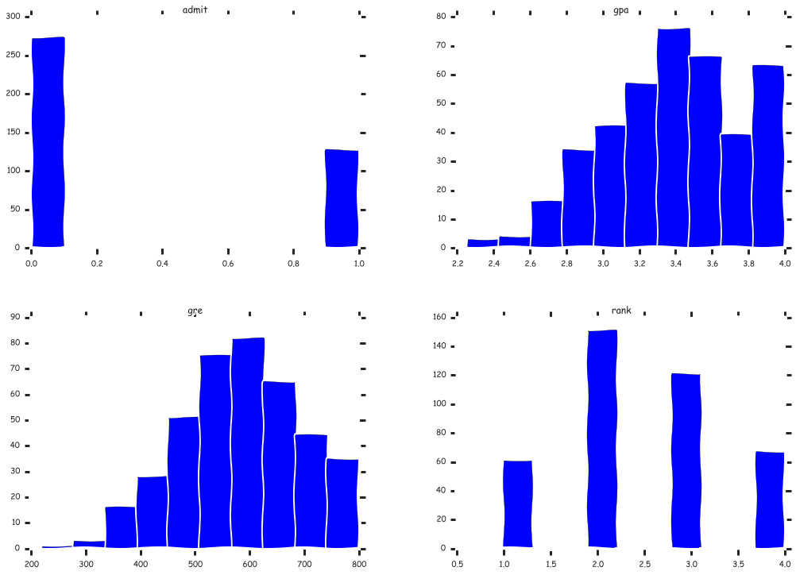

翻译自: http://blog.yhathq.com/posts/logistic-regression-and-python.html

# Introduction

Logistic Regression是种常用于分类的回归模型. 广泛应用在金融信贷, 药物研究, 犯罪学, 等领域. 这篇文章讲Python的实现.

要准备的积累知识:

* numpy

* pandas

* statsmodels

* pylab

测试数据源, 一组ucla的简单数据. 

    %matplotlib inline
    import seaborn as sns
    import pandas as pd
    import statsmodels.api as sm
    import matplotlib.pyplot as plt
    import numpy as np
     
    
    df = pd.read_csv("http://www.ats.ucla.edu/stat/data/binary.csv") 

# Summary Statistics

数据的建模基础需要数据分析, 检视. 
包括 summary, descirbe, missing value , ... 

    # describe 往往作为了解某未知数据集的第一步 
    # 可得到信息: (数值型变量的)列名,  频数, 均值, 标准差, 各分位数等.
    
    df.describe()

<table border="1" class="dataframe">
  <thead>
    <tr style="text-align: right;">
      <th></th>
      <th>admit</th>
      <th>gre</th>
      <th>gpa</th>
      <th>rank</th>
    </tr>
  </thead>
  <tbody>
    <tr>
      <th>count</th>
      <td>400.000000</td>
      <td>400.000000</td>
      <td>400.000000</td>
      <td>400.00000</td>
    </tr>
    <tr>
      <th>mean</th>
      <td>0.317500</td>
      <td>587.700000</td>
      <td>3.389900</td>
      <td>2.48500</td>
    </tr>
    <tr>
      <th>std</th>
      <td>0.466087</td>
      <td>115.516536</td>
      <td>0.380567</td>
      <td>0.94446</td>
    </tr>
    <tr>
      <th>min</th>
      <td>0.000000</td>
      <td>220.000000</td>
      <td>2.260000</td>
      <td>1.00000</td>
    </tr>
    <tr>
      <th>25%</th>
      <td>0.000000</td>
      <td>520.000000</td>
      <td>3.130000</td>
      <td>2.00000</td>
    </tr>
    <tr>
      <th>50%</th>
      <td>0.000000</td>
      <td>580.000000</td>
      <td>3.395000</td>
      <td>2.00000</td>
    </tr>
    <tr>
      <th>75%</th>
      <td>1.000000</td>
      <td>660.000000</td>
      <td>3.670000</td>
      <td>3.00000</td>
    </tr>
    <tr>
      <th>max</th>
      <td>1.000000</td>
      <td>800.000000</td>
      <td>4.000000</td>
      <td>4.00000</td>
    </tr>
  </tbody>
</table>

    # crosstab 是列联表分析用的函数, 多用于分析两个分组变量的crosstable
    # 这里返回各组合的频数 (类似R中函数 table )
    pd.crosstab(df['admit'], df['rank'])

<table border="1" class="dataframe">
  <thead>
    <tr style="text-align: right;">
      <th>rank</th>
      <th>1</th>
      <th>2</th>
      <th>3</th>
      <th>4</th>
    </tr>
    <tr>
      <th>admit</th>
      <th></th>
      <th></th>
      <th></th>
      <th></th>
    </tr>
  </thead>
  <tbody>
    <tr>
      <th>0</th>
      <td>28</td>
      <td>97</td>
      <td>93</td>
      <td>55</td>
    </tr>
    <tr>
      <th>1</th>
      <td>33</td>
      <td>54</td>
      <td>28</td>
      <td>12</td>
    </tr>
  </tbody>
</table>

    # 在IPython 下使用 %matplotlib inline 
    # 能够快速的完成数据可视化的工作, 比如对数据集的 4列信息的hist图形
    
    plt.xkcd()
    fig = plt.figure()
    fig = df.hist(figsize=(17, 12))
    plt.show()

    <matplotlib.figure.Figure at 0x11397f750>

# dummify

在回归问题时, 在处理分组变量(比如A,B,C,D这个四水平分组变量, 要转化为0,1,2,3)但又不希望0,1,2,3其数值上的意义对模型造成影响(这四个组在模型中并没有先后顺序)

因此引入dummy variable (即 用多个 0-1组成的编码变量) 来替代原始变量, 生成的dummy variables可能个数较多(取决于分组水平数), 但减少了干扰.

    dummy_ranks = pd.get_dummies(df['rank'], prefix='rank')
    dummy_ranks.head()

<table border="1" class="dataframe">
  <thead>
    <tr style="text-align: right;">
      <th></th>
      <th>rank_1</th>
      <th>rank_2</th>
      <th>rank_3</th>
      <th>rank_4</th>
    </tr>
  </thead>
  <tbody>
    <tr>
      <th>0</th>
      <td>0</td>
      <td>0</td>
      <td>1</td>
      <td>0</td>
    </tr>
    <tr>
      <th>1</th>
      <td>0</td>
      <td>0</td>
      <td>1</td>
      <td>0</td>
    </tr>
    <tr>
      <th>2</th>
      <td>1</td>
      <td>0</td>
      <td>0</td>
      <td>0</td>
    </tr>
    <tr>
      <th>3</th>
      <td>0</td>
      <td>0</td>
      <td>0</td>
      <td>1</td>
    </tr>
    <tr>
      <th>4</th>
      <td>0</td>
      <td>0</td>
      <td>0</td>
      <td>1</td>
    </tr>
  </tbody>
</table>

    # 因此构建一个新的数据集, dummy variables 无須用全部, 只用后面三个就可以表示(2\3\4皆为0 则表为1)
    
    new_df = df[['admit', 'gre', 'gpa']].join(dummy_ranks.ix[:, 'rank_2':])
    
    # 另外, 为了让回归模型拥有截距项, 增加一列常数列(皆为1)
    
    new_df['intercept'] = 1.0
    
    
    new_df.head()

<table border="1" class="dataframe">
  <thead>
    <tr style="text-align: right;">
      <th></th>
      <th>admit</th>
      <th>gre</th>
      <th>gpa</th>
      <th>rank_2</th>
      <th>rank_3</th>
      <th>rank_4</th>
      <th>intercept</th>
    </tr>
  </thead>
  <tbody>
    <tr>
      <th>0</th>
      <td>0</td>
      <td>380</td>
      <td>3.61</td>
      <td>0</td>
      <td>1</td>
      <td>0</td>
      <td>1</td>
    </tr>
    <tr>
      <th>1</th>
      <td>1</td>
      <td>660</td>
      <td>3.67</td>
      <td>0</td>
      <td>1</td>
      <td>0</td>
      <td>1</td>
    </tr>
    <tr>
      <th>2</th>
      <td>1</td>
      <td>800</td>
      <td>4.00</td>
      <td>0</td>
      <td>0</td>
      <td>0</td>
      <td>1</td>
    </tr>
    <tr>
      <th>3</th>
      <td>1</td>
      <td>640</td>
      <td>3.19</td>
      <td>0</td>
      <td>0</td>
      <td>1</td>
      <td>1</td>
    </tr>
    <tr>
      <th>4</th>
      <td>0</td>
      <td>520</td>
      <td>2.93</td>
      <td>0</td>
      <td>0</td>
      <td>1</td>
      <td>1</td>
    </tr>
  </tbody>
</table>

# Regression 

如果说不涉及到Logit模型的理论部分, 而只用函数来实现这一部分, 并查看建模结果, 那么操作起来是非常容易的. 

    # split data into training and test
    
    x_cols = new_df.columns[1:]
    
    # use statsmodels as modeler
    
    logit = sm.Logit(new_df['admit'], new_df[x_cols])
    
    # fit
    
    res = logit.fit()

    Optimization terminated successfully.
             Current function value: 0.573147
             Iterations 6

    # 模型输出
    print res.summary()

                               Logit Regression Results                           
    ==============================================================================
    Dep. Variable:                  admit   No. Observations:                  400
    Model:                          Logit   Df Residuals:                      394
    Method:                           MLE   Df Model:                            5
    Date:                Mon, 29 Jun 2015   Pseudo R-squ.:                 0.08292
    Time:                        22:41:05   Log-Likelihood:                -229.26
    converged:                       True   LL-Null:                       -249.99
                                            LLR p-value:                 7.578e-08
    ==============================================================================
                     coef    std err          z      P>|z|      [95.0% Conf. Int.]
    ------------------------------------------------------------------------------
    gre            0.0023      0.001      2.070      0.038         0.000     0.004
    gpa            0.8040      0.332      2.423      0.015         0.154     1.454
    rank_2        -0.6754      0.316     -2.134      0.033        -1.296    -0.055
    rank_3        -1.3402      0.345     -3.881      0.000        -2.017    -0.663
    rank_4        -1.5515      0.418     -3.713      0.000        -2.370    -0.733
    intercept     -3.9900      1.140     -3.500      0.000        -6.224    -1.756
    ==============================================================================

    print res.summary2()

                             Results: Logit
    =================================================================
    Model:              Logit            Pseudo R-squared: 0.083     
    Dependent Variable: admit            AIC:              470.5175  
    Date:               2015-06-29 22:41 BIC:              494.4663  
    No. Observations:   400              Log-Likelihood:   -229.26   
    Df Model:           5                LL-Null:          -249.99   
    Df Residuals:       394              LLR p-value:      7.5782e-08
    Converged:          1.0000           Scale:            1.0000    
    No. Iterations:     6.0000                                       
    ------------------------------------------------------------------
                   Coef.   Std.Err.     z     P>|z|    [0.025   0.975]
    ------------------------------------------------------------------
    gre            0.0023    0.0011   2.0699  0.0385   0.0001   0.0044
    gpa            0.8040    0.3318   2.4231  0.0154   0.1537   1.4544
    rank_2        -0.6754    0.3165  -2.1342  0.0328  -1.2958  -0.0551
    rank_3        -1.3402    0.3453  -3.8812  0.0001  -2.0170  -0.6634
    rank_4        -1.5515    0.4178  -3.7131  0.0002  -2.3704  -0.7325
    intercept     -3.9900    1.1400  -3.5001  0.0005  -6.2242  -1.7557
    =================================================================
    

# summary 解读

模型综述 = 模型总体评估统计量, R square + AIC + BIC ...

模型细节 = beta 系数 及各自的t检验

...
...

多做些数学系学子做过的事情吧! 
Mo Ha Ha~~

    
    # Reference about Logit
    
    > https://en.wikipedia.org/wiki/Logit
        
    logit(p) 可理解为对概率p的一个变换函数
    
    logit(p) = log(p/(1-p)) = log(p) - log(1-p) = -log(1/p - 1)
    
    所以通过对指数变换, 得到
    
    logit 的 e 指数表达形式. 
